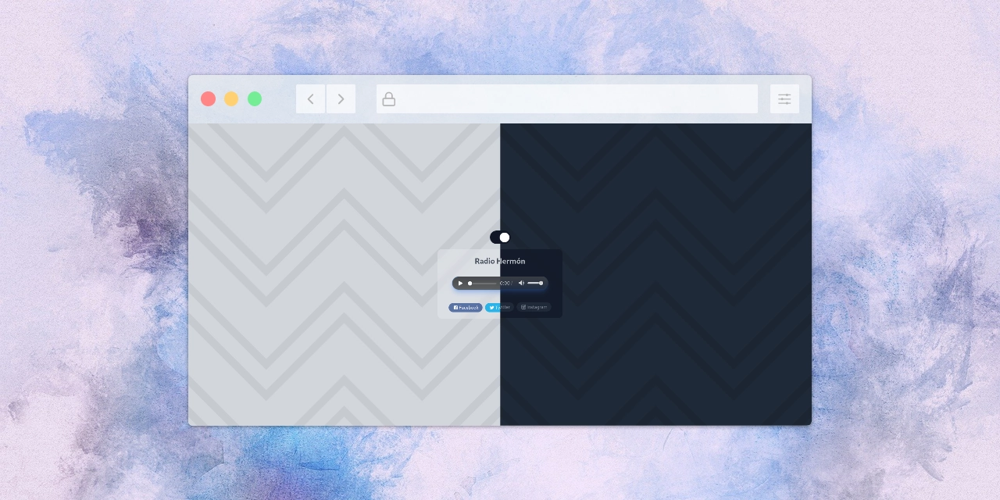

<div id="header" align="center">  
  

# Hermon Radio &middot;  [](https://www.npmjs.com/package/react) [](LICENSE)  
Church Radio PWA with advanced streaming overlays, crafted with Vite and Tailwind CSS.  
</div>  

### Prerequisites
- Vercel account with Edge Config.
- Node.js 18+ or Bun locally.
- Optional Edge Config instance: `vercel edge-config create hermon-overlay`.

### Using npm:
```bash
npm install
npm run dev
```

### Using Bun (recommended):
```bash
bun install
bun run dev:bun
```

## :star2: Main Features  

### **Frontend / UI:**  
- ⚛️ **React**: Utilizes React to create dynamic user interfaces.  
- 🎨 **Tailwind CSS**: Employs Tailwind CSS for a responsive and modern design.  
- 🔍 **Fontello**: Integrates Fontello for efficient icon management.  
- ⚡ **Vite**: Utilizes Vite as a fast development and build tool for modern web applications.  

### **Custom Audio Player Features:**  
- 📡 **Dynamic Stream Monitoring**: Continuously tracks and updates the audio stream status (active, connecting, error) in real-time.  
- 🎶 **Playback Detection**: Validates actual audio playback to ensure the correct status representation, even when network issues occur.  
- 💬 **Interactive Feedback**: Provides tooltips that display the current stream status when the user hovers over the status indicator.  
- 🎥 **Media Source Detection**: Automatically identifies whether the provided URL is an audio or video stream.  
- 🚫 **Enterprise-Level Error Handling**: Implements a robust error handling mechanism that addresses network issues, ensuring users are informed of any playback interruptions effectively.  
- 🔁 **Persistent Playback State**: Saves user playback preferences, enabling seamless restoration of audio playback after component reloads.  

### **Stream Overlay (Admin) Features:**  
- 🛠️ **Intuitive Admin Panel**: Responsive overlay controls with icon-based interface and tooltips.
- 🖼️ **Content Types**: Image, YouTube, Text, and optional Live Camera (HLS) streaming.
- 🧭 **Display Modes**: Inline (integrated in card) or Fullscreen with intuitive icon buttons.
- 📐 **Image Fitting**: Contain (show full image) or Cover (fill area) with visual icon indicators.
- 🎨 **Text Styling**: Background and text color pickers with live preview.
- 📱 **Responsive Layout**: Optimized mobile interface with side-by-side controls to save space.
- 💾 **Data Persistence**: localStorage automatically saves all content and settings across sessions.
- 🔒 **Authentication**: Basic auth enforced via Vercel Edge Functions.
- 🔁 **Instant Sync**: Lightweight polling keeps clients updated with the latest overlay state.
- 🎬 **Cross-Platform Streaming**: Seamless switching between content types without interference.
- ♿ **Accessibility**: Full keyboard navigation, ARIA labels, and high-contrast focus indicators.

### **Enhanced User Experience:**
- 🖱️ **Click-to-Enlarge**: Program images open in full-size modal gallery.
- 🔄 **Smooth Transitions**: Optimized animations that don't interfere with live streaming.
- 📊 **Visual Feedback**: Color-coded controls and status indicators for intuitive operation.
- 🌙 **Dark Mode Support**: Complete dark/light theme compatibility across all components.

## 🚀 Deployment (Vercel front + API)

- Single Vercel project for frontend SPA and Edge API (`api/hermon/*`).
- Overlay state stored in Vercel Edge Config (fallback to in-memory when tokens missing).


### Environment Variables

**Frontend (project: hermon-radio)**
| Name | Purpose |
| --- | --- |
| `VITE_OVERLAY_BASE_URL` | Overlay API base, e.g. `https://hermon-api.vercel.app/api/hermon` |
| `VITE_STREAM_HLS_URL` | *(optional)* HLS source when live |

**Edge API (project: hermon-radio-api)**
| Name | Purpose |
| --- | --- |
| `VERCEL_ADMIN_USER` | Basic auth user for admin panel |
| `VERCEL_ADMIN_PASS` | Basic auth password |
| `EDGE_CONFIG` | Connection string (`https://edge-config.vercel.com/<id>/config?token=<uuid>`) |
| `EDGE_CONFIG_ID` | *(optional)* Manual override for Edge Config ID |
| `EDGE_CONFIG_READ_TOKEN` | *(optional)* Manual override for read token |
| `EDGE_CONFIG_WRITE_TOKEN` | *(optional)* Manual override for write token |

### Deploy Steps
1. Link repo in Vercel (Framework: Vite, build `npm run build`, output `dist`).
2. Populate env vars above (set `EDGE_CONFIG` via Vercel Edge Config → “Connect to project”).
3. Deploy; Vercel bundles frontend + Edge Functions automatically.
4. Frontend polls `GET /api/hermon/overlay` every 10s; admin updates via `PUT` with Basic Auth.

### Local Development
1. Copy `.env.example` ➜ `.env.local`, adjust `VITE_OVERLAY_BASE_URL` (e.g. `http://localhost:3000/api/hermon`).
2. Run `npm run dev` (frontend) and `vc dev` if emulating Vercel functions.
3. Without Edge Config tokens, state resets between restarts (expected).

### Troubleshooting
- 401 admin login → check `VERCEL_ADMIN_*` values.
- Overlay stale → confirm Edge Config tokens/ID and redeploy.
- Edge Config failures → reissue tokens and update Vercel env.
- HLS optional; player hides gracefully when `VITE_STREAM_HLS_URL` missing.

## :shipit: Special Thanks  
* To this church's flock.  
* To my mom and my sister for their artistic wit.  

## :brain: Acknowledgments  

*"Whoever loves discipline loves knowledge, but whoever hates correction is stupid."*