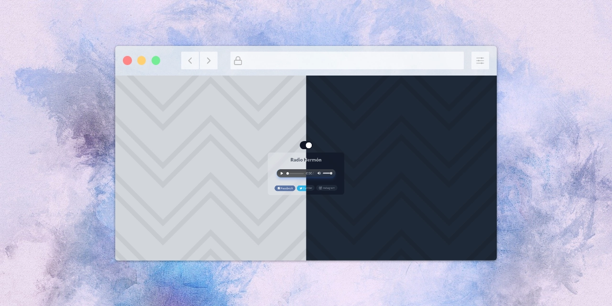

<div id="header" align="center">  
  

# Hermon Radio &middot;  [](https://www.npmjs.com/package/react) [](LICENSE)  
Church Radio PWA with advanced streaming overlays, crafted with Vite and Tailwind CSS.  
</div>  

## :gear: Install & Run  
You'll need Node.js 18+ or Bun.  

### Using npm:
```bash
npm install
npm run dev
```

### Using Bun (recommended):
```bash
bun install
bun run dev:bun
```

## :star2: Main Features  

### **Frontend / UI:**  
- ⚛️ **React**: Utilizes React to create dynamic user interfaces.  
- 🎨 **Tailwind CSS**: Employs Tailwind CSS for a responsive and modern design.  
- 🔍 **Fontello**: Integrates Fontello for efficient icon management.  
- ⚡ **Vite**: Utilizes Vite as a fast development and build tool for modern web applications.  

### **Custom Audio Player Features:**  
- 📡 **Dynamic Stream Monitoring**: Continuously tracks and updates the audio stream status (active, connecting, error) in real-time.  
- 🎶 **Playback Detection**: Validates actual audio playback to ensure the correct status representation, even when network issues occur.  
- 💬 **Interactive Feedback**: Provides tooltips that display the current stream status when the user hovers over the status indicator.  
- 🎥 **Media Source Detection**: Automatically identifies whether the provided URL is an audio or video stream.  
- 🚫 **Enterprise-Level Error Handling**: Implements a robust error handling mechanism that addresses network issues, ensuring users are informed of any playback interruptions effectively.  
- 🔁 **Persistent Playback State**: Saves user playback preferences, enabling seamless restoration of audio playback after component reloads.  

### **Stream Overlay (Admin) Features:**  
- 🛠️ **Intuitive Admin Panel**: Responsive overlay controls with icon-based interface and tooltips.
- 🖼️ **Content Types**: Image, YouTube, Text, and Live Camera (HLS) streaming.
- 🧭 **Display Modes**: Inline (integrated in card) or Fullscreen with intuitive icon buttons.
- 📐 **Image Fitting**: Contain (show full image) or Cover (fill area) with visual icon indicators.
- 🎨 **Text Styling**: Background and text color pickers with live preview.
- 📱 **Responsive Layout**: Optimized mobile interface with side-by-side controls to save space.
- 💾 **Data Persistence**: localStorage automatically saves all content and settings across sessions.
- 🔒 **Authentication**: Secure admin access with backend credential validation.
- 🔴 **Real-time Broadcasting**: Server-Sent Events (SSE) for instant updates to all connected clients.
- 🎬 **Cross-Platform Streaming**: Seamless switching between content types without interference.
- ♿ **Accessibility**: Full keyboard navigation, ARIA labels, and high-contrast focus indicators.

### **Enhanced User Experience:**
- 🖱️ **Click-to-Enlarge**: Program images open in full-size modal gallery.
- 🔄 **Smooth Transitions**: Optimized animations that don't interfere with live streaming.
- 📊 **Visual Feedback**: Color-coded controls and status indicators for intuitive operation.
- 🌙 **Dark Mode Support**: Complete dark/light theme compatibility across all components.

See `docs/DEPLOYMENT.md` for deployment and usage details.

## :shipit: Special Thanks  
* To this church's flock.  
* To my mom and my sister for their artistic wit.  

## :brain: Acknowledgments  

*"Whoever loves discipline loves knowledge, but whoever hates correction is stupid."*  